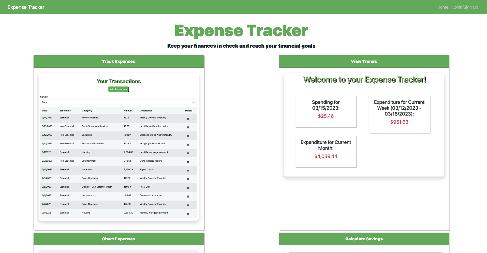
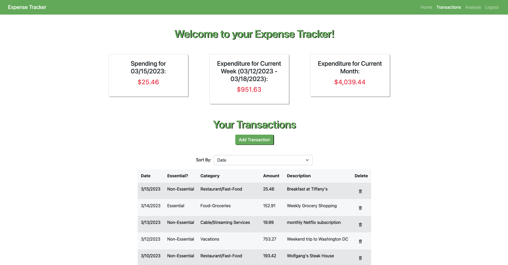
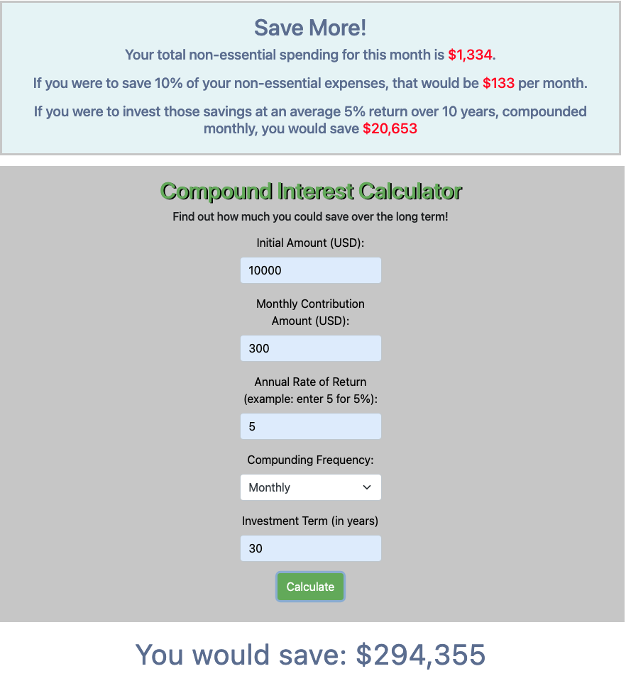
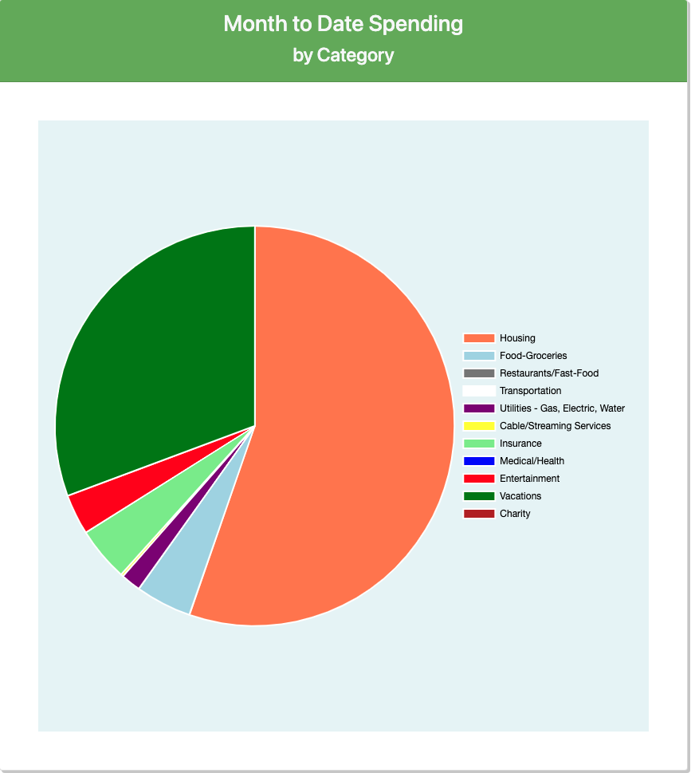

## Expense-Tracker-Mern-Main

#Description
Expense Tracker is a full stack MERN app which allows users to track their personal expenses. Upon sign in, a user can enter expense transactions and categorize them as essential vs non-essential and into various sub-categories (Housing, Food, Utilities, Entertainment, etc). Expenses are displayed by category into pie charts. The app also features a compound interest calculator so users can run scenarios where they might save a certain percentage of their non-essential expenses per month and see how much that translates into long term gains.

Screenshots:

## Table of Contents
- [Installation](#installation)
- [Usage](#usage)
- [License](#license)
- [Contributors](#contributors)
- [Tests](#tests)
- [Questions](#questions)

## Usage

sign up/log in to deployed URL above

## License

This project is licensed under the terms of the [MIT License](./LICENSE).

## Contributors
Riya Hablani https://github.com/RiyaHablani
Pranav Sharma https://github.com/pranav-1610
Pratap Kanase https://github.com/Pratap-Kanase
